# Đồ án Lập trình web và ứng dụng nâng cao

### Thành viên trong nhóm

| STT |    MSSV    | Họ và tên       |
| :-: | :--------: | --------------- |
|  1  | 3121410422 | Trần Nhật Sinh  |
|  2  | 3121410069 | Hoàng Gia Bảo   |
|  3  | 3121410370 | Âu Hạo Nhiên    |
|  4  | 3121410223 | Đặng Lê Anh Huy |

### Hướng dẫn cài đặt

Cấu hình thông tin database và đường dẫn trang chủ tại file config.php

### Tài khoản Admin

- Username: 3121410422
- Password: 123456

### Chức năng
1. Landing page giới thiệu hệ thống
2. Đăng nhập, đăng xuất.
3. Đăng nhập sử dụng cơ chế lưu token 
4. Đăng nhập sử dụng tài khoản Google (trường hợp đã liên kết với tài khoản Google).
5. Quên mật khẩu gửi mã OTP về email (trường hợp đã liên kết với tài khoản Google).
6. Cho phép sinh viên cập nhật hồ sơ.
7. Thêm, xóa, chỉnh sửa câu hỏi, môn học, chương, đề thi, nhóm học phần, phân công giảng dạy, nhóm quyền, thông báo,người dùng.
8. Tìm kiếm, phân trang sử dụng Ajax.
9. Phân quyền linh động trong hệ thống.
10. Phân công giảng dạy (những giảng viên được phân công dạy môn học nào thì chỉ được tạo nhóm học phần, thêm câu hỏi ở những môn đó)
11. Đọc câu hỏi ở file word và import lên hệ thống (cấu trúc file word tự quy định).
12. Import danh sách sinh viên vào hệ thống.
13. Sinh viên tham gia nhóm học phần bằng mã mời.
14. In kết quả bài làm khi sinh viên thi xong (in 1 sinh viên / in toàn bộ nhóm).
15. Xuất báo cáo kết quả thi tất cả các bài kiểm tra.
16. Đề kiểm tra có 2 dạng
a. Đề thi thủ công (Giảng viên tự chọn từng câu hỏi), cho phép cấu hình đảo câu hỏi, đảo câu trả lời.
b. Đề thi tự động (Giảng viên chỉ cần nhập số lượng câu hỏi ở từng mức độ, chương và hệ thống sẽ tự động ra đề, mỗi sinh viên sẽ có một đề khác nhau)
17. Phát hiện sinh viên chuyển tab khi kiểm tra và ghi nhận lại số lần thoát tab.
18. Giới hạn thời gian bắt đầu và thời gian kết thúc đề thi.
19. Tự động nộp bài khi sinh viên chuyển tab.
20. Lưu lại các đáp án sinh viên đã chọn khi ấn nhầm tắt trình duyệt.
21. Sinh viên có thể xem lại bài thi của mình (khi cấu hình đề thi cho phép xem).
22. Thống kê điểm số của sinh viên tham gia đề thi.
23. Lọc sinh viên đã tham gia, chưa tham gia thi hoặc đã thi xong.
24. Sắp xếp theo tên, điểm số của sinh viên ở từng đề kiểm tra

### Giao diện

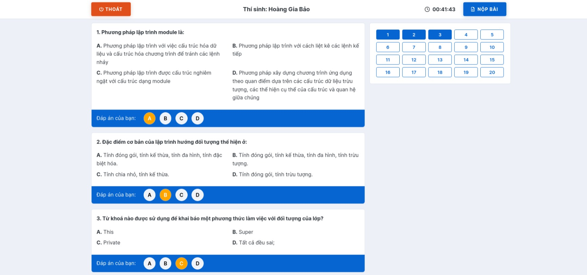

<h4 align="center">Giao diện lúc thi</h4>

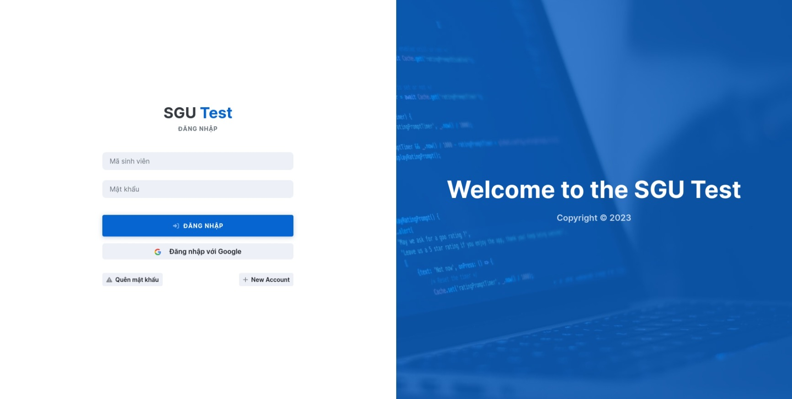

<h4 align="center">Đăng nhập</h4>

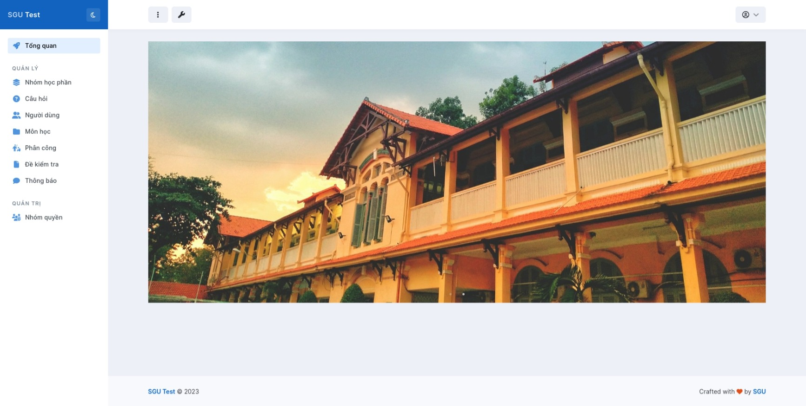

<h4 align="center">Tổng quan</h4>

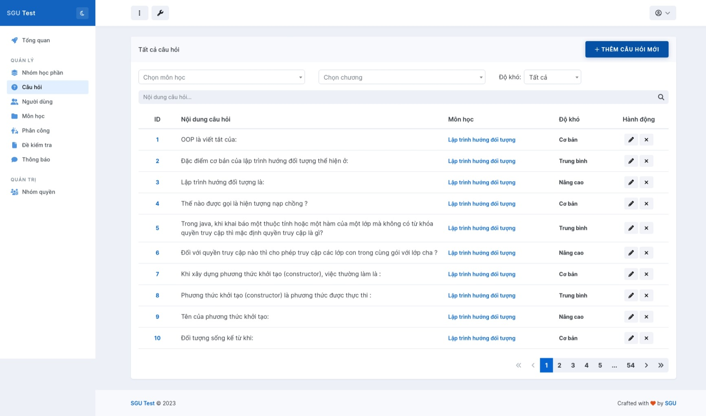

<h4 align="center">Câu hỏi</h4>

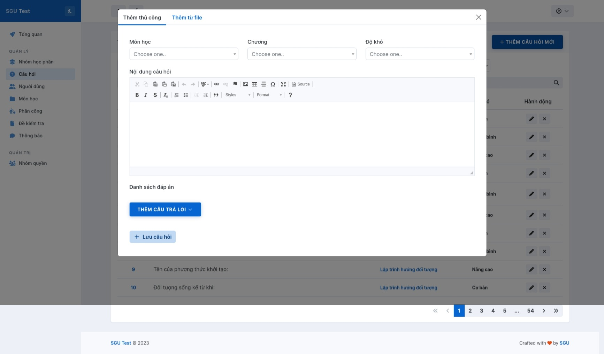

<h4 align="center">Thêm câu hỏi</h4>

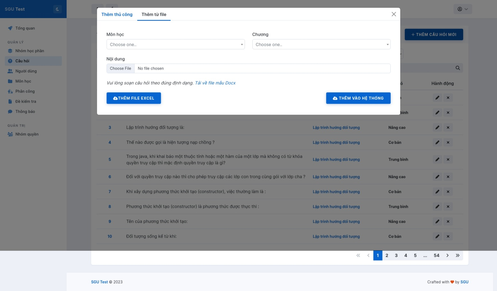

<h4 align="center">Thêm câu hỏi từ file</h4>

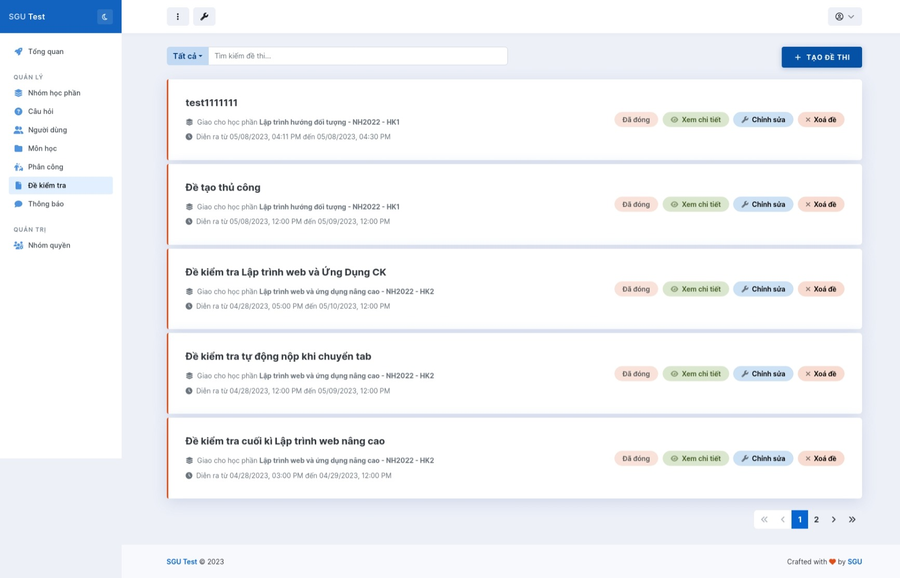

<h4 align="center">Đề kiểm tra</h4>

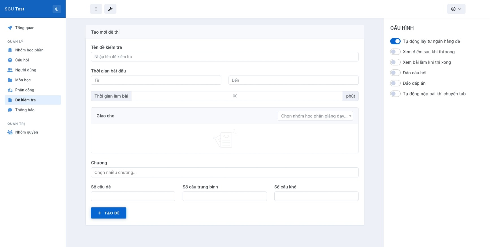

<h4 align="center">Thêm đề kiểm tra</h4>

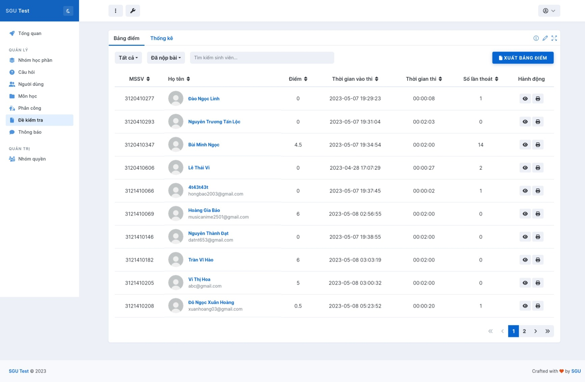

<h4 align="center">Điểm thi</h4>

<h4 align="center">Nhóm học phần</h4>

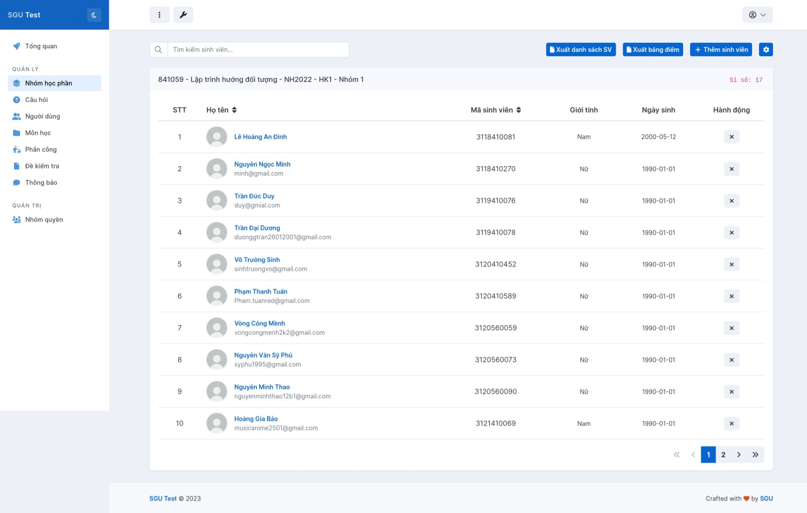

<h4 align="center">Chi tiết nhóm học phần</h4>

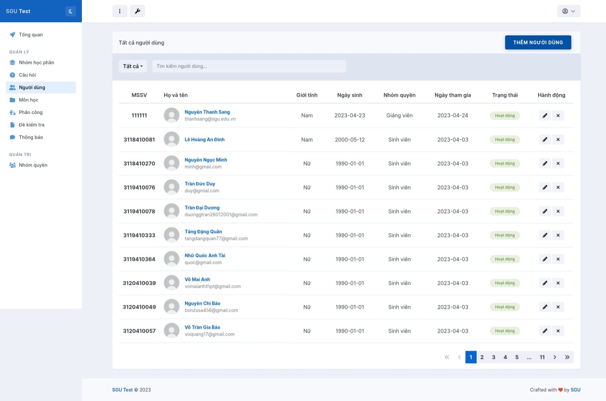

<h4 align="center">Người dùng</h4>

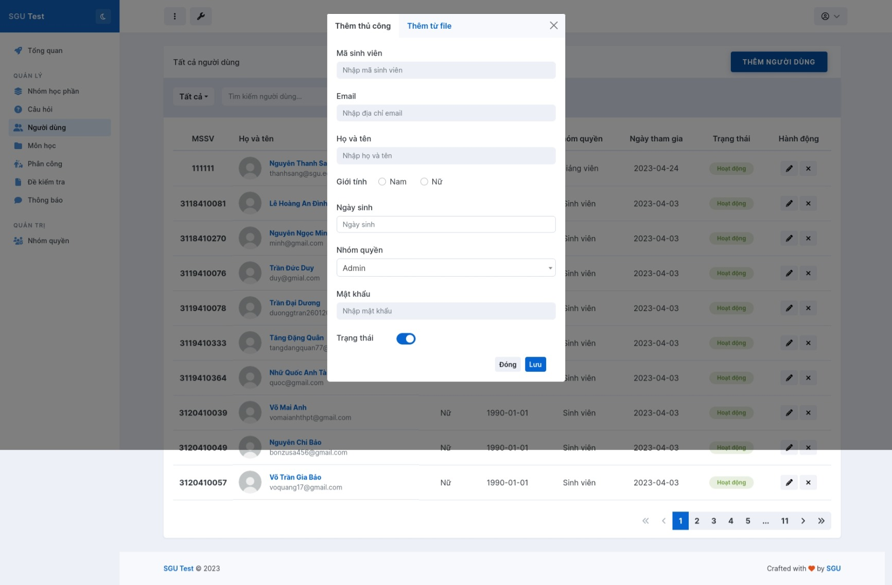

<h4 align="center">Thêm người dùng thủ công</h4>

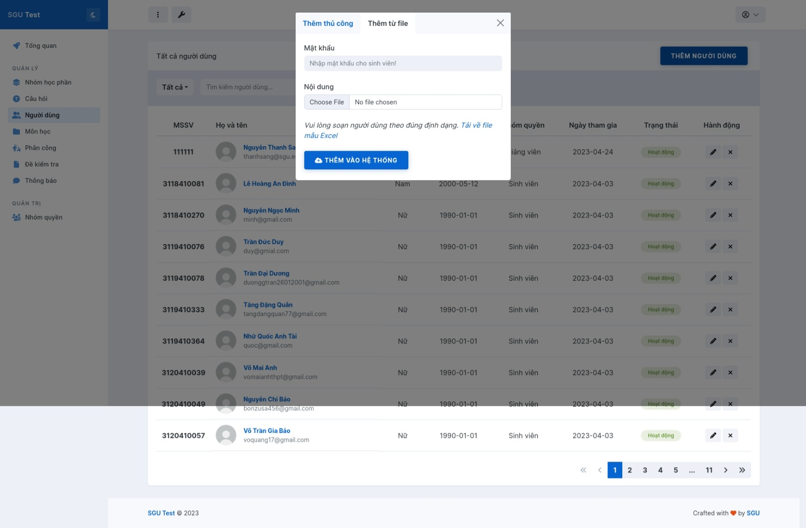

<h4 align="center">Thêm người dùng từ file</h4>
